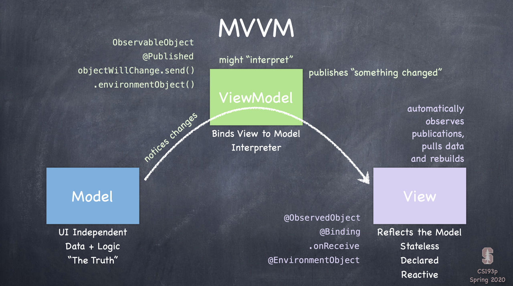
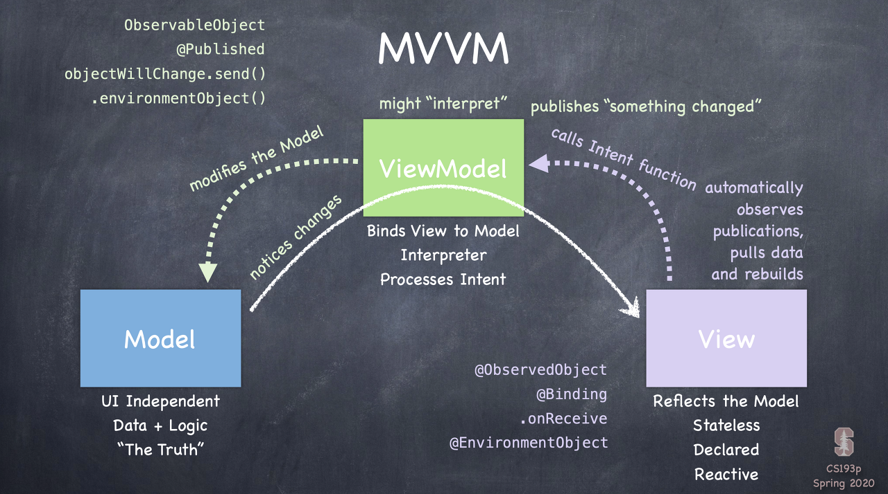

# 👩‍💻

## MVVM 패턴 


### 모델에서 뷰로
- 모델 구조체에 변경이 있다면 뷰모델한테 변경이 있음을 알려준다.
- 뷰는 뷰모델을 관찰하고 있다가 자동적으로 뷰를 그린다.
(즉 뷰모델은 뷰에 대한 포인터를 가지지 않으며, 뷰에게 변경 사항을 직접적으로 전달하지 않는다.) 


### 뷰에서 모델로
- 뷰에서 버튼이 눌리거나 제스처에 액션이 발생하면 인텐트 함수를 호출한다.
- 뷰모델은 모델에게 수정을 요청한다.

### Cycle ♽
- 모델이 수정되었다.
- 변경사항이 있다고 뷰모델에게 노티가 간다.
- 뷰모델을 구독하고 있던 뷰는 자동적으로 뷰를 그린다.

## ObservableObject 프로토콜
> 모델과 뷰를 쉽게 바인딩할 수 있게 해주는 프로토콜
```
protocol ObservableObject : AnyObject
```

- ObservableObject프로토콜에는 `var objectWillChange: ObservableObjectPublisher`이 존재
- ObservableObject프로토콜을 채택한다면 var objectWillChange는 선언하지 않아도 사용할 수 있다.

- 구현했던 카드 뒤집기에 적용해보자면, 퍼블리셔가 send를 보내야 하는 시점을 생각해보면 유저가 카드를 선택했을 때 
  ```
  func choose(card:MemoryGame<String>.Card) {
      model.choose(card: card)
      objectWillChange.send()
  }
  ```
  - 뷰모델에 구현되어 있는 인텐트 함수`func choose(card:MemoryGame<String>.Card)`에 `objectWillChange.send()`을 호출
  - 뷰는 뷰모델을 구독하고 있다가 `objectWillChange.send()`를 통해 변화가 감지되는 것을 확인할 수 있다.

### @Published
> 뷰모델에서 구현: 모델 변수에 @Pubished 프로퍼티 래퍼를 붙여준다. 
```
@Published private var model: MemoryGame<String> = EmojiMemoryGame.createMemoryGame()
```
- 일일이 objectwillChange.send()를 호출하지 않아도 model이 변화할 때마다 objectwillChange.send()가 호출된다.

### @ObservedObject 
> 뷰에서 구현: 뷰에서 뷰모델 변수에 변수에 @ObservedObject 프로퍼티 래퍼를 붙여준다.
```
@ObservedObject var viewmodel: EmojiMemoryGame
```
- ObservableObject를 구독하고 있으며 값이 업데이트 되면 뷰를 갱신하는 property wrapper이다.
- 이 프로퍼티 래퍼는 objectWillChange.send()가 호출되면 뷰를 다시 그리게 된다.
- SwiftUI는 똑똑하기 때문에 전체를 그리지 않고 필요한 일부를 그린다
  - ex) 하나의 카드가 플립 되었을 때는 나머지는 그대로 두고 변경이 일어난 카드만 다시 그린다.

https://developer.apple.com/documentation/combine/observableobject

## Rounded Rectangle
> 모서리가 둥근 직사각형 모양이고 frame 내부에 정렬해준다.
```
@frozen public struct RoundedRectangle : Shape {
    
}
```

- RoundedRectangle구조체는 Shape 프로토콜을 채택한다.
    - Shape프로토콜은 뷰를 그릴 때 사용 가능할 수 있다. (2D)
    - `protocol Shape : Animatable, View` 

https://developer.apple.com/documentation/swiftui/roundedrectangle

## GeometryReader 
```
@frozen public struct GeometryReader<Content> : View where Content : View {
    public var content: (GeometryProxy) -> Content
    @inlinable public init(@ViewBuilder content: @escaping (GeometryProxy) -> Content)
    public typealias Body = Never
}
```
- 뷰의 사이즈와 좌표를 읽어들이고 GeometryProxy구조체를 리턴해준다.

```
public struct GeometryProxy {
    public var size: CGSize { get }
    public subscript<T>(anchor: Anchor<T>) -> T { get }
    public var safeAreaInsets: EdgeInsets { get }
    public func frame(in coordinateSpace: CoordinateSpace) -> CGRect
}
```
- size는 GeometryReader가 사용할 수있는 공간의 크기이다.
- safeAreaInsets는 GeometryReader의 safe area inset을 제공하는 EdgeInsets 구조체 의 인스턴스이다.

https://developer.apple.com/documentation/swiftui/geometryreader  
https://developer.apple.com/documentation/swiftui/geometryproxy

## View
> UI일부를 표현하며 View를 설정하는데 사용하는 메서드를 제공한다.
```
public protocol View {
    associatedtype Body : View
    @ViewBuilder var body: Self.Body { get }
}
```
- body 연산 프로퍼티는 커스텀 뷰의 컨텐츠를 제공하는데 사용
- View 프로토콜을 채택한 한개 이상의 뷰들을 조합해서 뷰의 body를 구성할 수 있음.

https://developer.apple.com/documentation/swiftui/view
