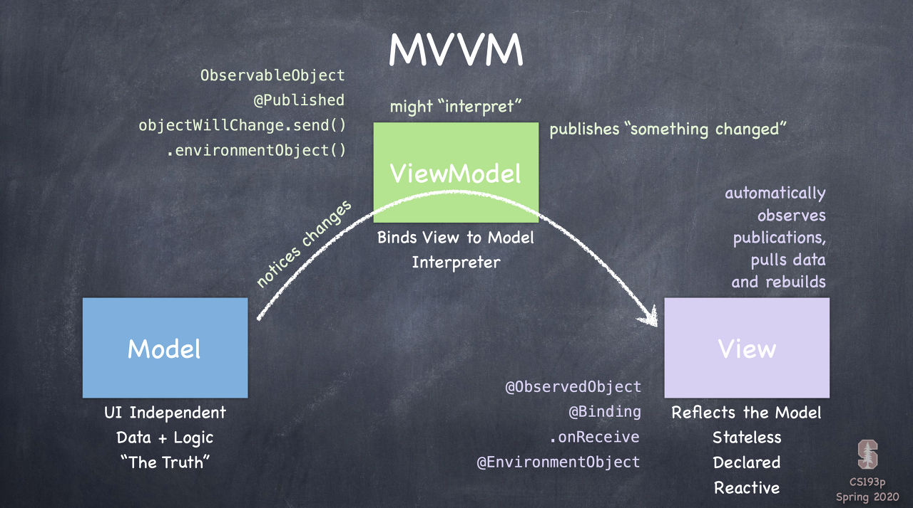
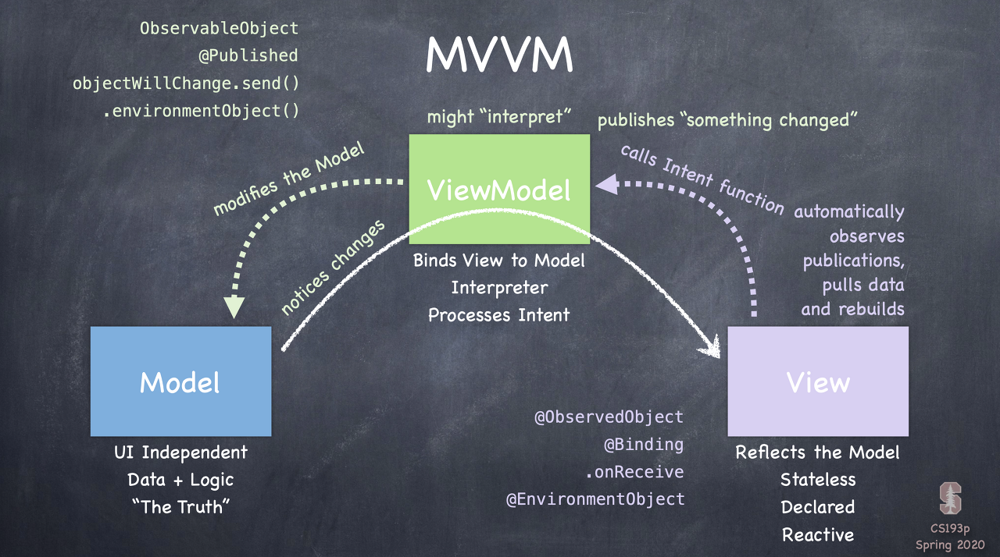

# 👩‍💻

## MVVM 패턴 

### 모델에서 뷰로
- 모델 구조체에 변경이 있다면 뷰모델한테 변경이 있음을 알려준다.
- 뷰는 뷰모델을 관찰하고 있다가 자동적으로 뷰를 그린다.
(즉 뷰모델은 뷰에 대한 포인터를 가지지 않으며, 뷰에게 변경 사항을 직접적으로 전달하지 않는다.) 

### 뷰에서 모델로
- 뷰에서 버튼이 눌리거나 제스처에 액션이 발생하면 인텐트 함수를 호출한다.
- 뷰모델은 모델에게 수정을 요청한다.

### ♽
- 모델이 수정되었다.
- 변경사항이 있다고 뷰모델에게 노티가 간다.
- 뷰모델을 구독하고 있던 뷰는 자동적으로 뷰를 그린다.

