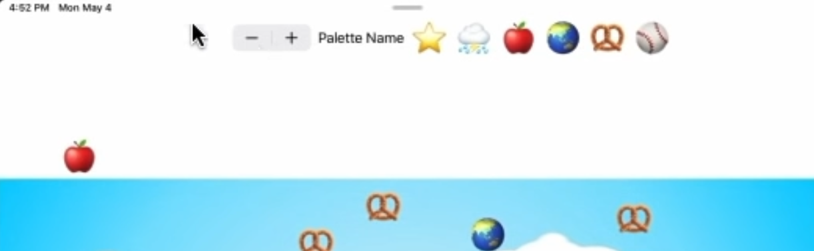

## Reference
[Lecture 9](https://youtu.be/0i152oA3T3s)

## [Property Wrappers](https://youtu.be/0i152oA3T3s?t=58)

A property wrapper is actually a struct. 
The wrapper struct does something on set/get of the wrappedValue.

```swift
@Published var emojiArt: EmojiArt = EmojiArt()

// Swift, when you do @Published, it builds one of these structs and make couple of vars available to you.
// The first one is _emojiArt. We have not seen this one but it's in there.
var _emojiArt: Published = Published(wrappedValue: EmojiArt())
// That tunrs out to be a computed property.
var emojiArt: EmojiArt {
	get { _emojiArt.wrappedValue }
	set { _emojiArt.wrappedValue = newValue }
}

struct Published {
	var wrappedValue: EmojiArt
	// That's totally up to the property wrapper.
	// Each property wrapper has a different projected value.
	// It chooses to have its projectValue be a Publisher that publishes the wrappedValue and never fails.
	// You can access this var using $emojiArt
	var projectedValue: Publisher<EmojiArt, Never>
}
```

- @Published
    - [When its wrapped value is set, it publishes it](https://youtu.be/0i152oA3T3s?t=345). @Published causes `objectWillChange.send` to happen in the ObservableObject it's in.
- @State
    - it store the wrapped value in the heap.
    - It also invalidates the View whenever that wrappedValue changes.
    - The projected value is Binding (a Binding is essentially a way to connect one var to another)
    - Taking the $value of a State let you have an object that you can use to bind to that value in the heap.
- @ObservedObject
    - It invalidates the View whenever the wrappedValue or the ViewModel does objectWillChange.send. Whenever that happens, it redraws the View.
    - The projected value is Binding (a Binding to the vars of the ViewModel).
- @Binding
    - The wrappedValue of @Binding is a value that's bound to some other thing somewhere else. It's bound to an @State in some other view.
    - An @Binding struct gets the value and sets the value of the wrappedValue by getting and setting the value of this other thing. It also invalidates the View.
    - The projected value is the Binding itself.
    - [Where do we use Binding?](https://youtu.be/0i152oA3T3s?t=529)
        - It's about having a single source of the truth for data.
    ```swift
    // If we have information in one View, in an @State
    // and we have information in another View in its @State,
    // and if that's the same information, they should be bound to each other
    // instead one of them trying to duplicate the other one. Which one is the truth?
    // So Binding are about creating variables that connect things together so that only one place has the actual truth.
    struct MyView: View {
        @State vart myString = "Hello"

        var body: some View {
            OtherView(sharedText: $myString)
        }
    }

    struct OtherView: View {
        @Binding var sharedText: String
    }
    ```
- @EnvironmentObject
    - It is almost identical to @ObservedObject.
    - You pass it by calling this function `.environmentObject`.
    - All of the Views in your body, if you have an EnvironmentObject on you, they all get that EnvironmentObject too without your having to say `.environmentObject` like foregroundColor on ZStack.
    - You can only have one EnvironmentObject wrapper per type of ViewModel in each View.
    You couldn't have two @EnvironmentObject in the same View.
- @Environment
    - It is nothing to do with @EnvironmentObject.
    - Environment takes this one argument, the argument there that you're gonna give it which it's gonna set one of its internal vars with, is a key path into an EnvironmentValues struct.
    - You're just gonna look EnvironmentValues up in the documentation. ex) .colorScheme is the current light mode or dark mode.
    - The projected value of @Environment is none.

## [Publisher](https://youtu.be/0i152oA3T3s?t=1099)

`Publisher<Output, Failure>` The output is just some type that this Publisher periodically emits. And the failure is the type of struct of information that it gives if it should fail to publish.

```swift
// `sink` is to execute a closure
// whenever the Publisher publishes its data 
// or when it finishes either cause it failed
// or it just completed normally.
// `sink` returns Cancellable protocol. (https://youtu.be/0i152oA3T3s?t=1332)
// 1. `Cancellable.cancel` will stop sinking
// 2. It keeps `.sink` alive. As long as that var cancellable exists then sink keeps sinking.
let cancellable = myPublisher.sink(
	receiveCompletion: { result in },
	receiveValue: { thingThePublisherPublishes in }
)

// https://youtu.be/0i152oA3T3s?t=2200
class EmojiArtDocument: ObservableObject {
	@Published var emojiArt: EmojiArt
	private var autosaveCancellable: AnyCancellable?

	init() {
		autosaveCancellable = $emojiArt.sink { emojiArt in
			UserDefaults.standard.set(emojiArt.json, forKey: EmojiArtDocument.untitled)
		}
	}
}
```

```swift
// https://youtu.be/0i152oA3T3s?t=1426
// Another way is for a View to listen to a Publisher.
// There is a ViewModifier on View called `.onReceive`.
// This closure will be called every time that Publisher publishes
// and your View will get invalidated causing it to redraw.
struct AnimationView: View {
	var body: some View {
		VStack {
		}
		.onReceive(NotificationCenter.default.publisher(
				for: .didEnterBackgroundNotification
			)
		) {
			// handle the data changes for updating views.
		}
	}
}

struct EmojiArtDocumentView: View {
	var body: some View {
		Color.white.overlay(
			OptionalImage(self.document.backgroundImage)
		)
		.clipped()
		.onReceive(self.document.$backgroundImage) { image in
			self.zoomToFit(image, in: geometry.size)
		}
	}
}
```

## Demo

### Spinning Image

```swift
// https://youtu.be/0i152oA3T3s?t=1790
// show loading view when loading remote images.
struct Spinning: ViewModifier {
	@State var isVisible = false
	func body(content: Content) -> some View {
		content
			.rotationEffect(Angle(degrees: isVisible ? 360 : 0))
			.animation(Animation.linear(duration: 1).repeatForever(autoreverses: false))
			.onAppear { self.isVisible = true }
	}
}

extension View {
	func spinnin() -> some View {
		self.modifier(Spinning())
	}
}

ZStack {
	Color.white
		.overlay(OptionalImage)
	if self.isLoaindg {
		Image(systemName: "")
			.imageScale(.large)
			.spinning()
	} else {
		ForEach(emojis) { emoji
			Text()
		}
	}
}
```

### Publisher handling

```swift
class EmojiArtDocument {
	private var fetchImageCancellable: AnyCancellable?
	@Published var backgroundImage: UIImage?

	func fetchImage() {
		fetchImageCancellable = session.dataTaskPublisher(for: url)
			.map { data, urlResponse in UIImage(data: data) }
			// https://youtu.be/0i152oA3T3s?t=2947
			// publishes them on the main queue.
			.receive(on: DispatchQueue.main)
			// Its error type has been changed to `Never`.
			.replaceError(with: nil)
			// https://youtu.be/0i152oA3T3s?t=3100
			// `assign` only works if you have as your error.
			// `assign` lets you assign the output of the Publisher to some var that you specify the using key path syntax. 
			.assign(to: \EmojiArtDocument.backgroundImage, on: self)
	}	
}
```

### FixedSize

| Before FixedSize                         | After FixedSize                          |
| ---------------------------------------- | ---------------------------------------- |
|  |  |


### Stepper
```swift
struct PaletteChooser: View {
	var body: some View {
		HStack {
			// https://youtu.be/0i152oA3T3s?t=3438
			// The Stepper is lika a little plus minus button. Has a lot of initializer.
			Stepper(
				onIncrement: {},
				onDecrement: {},
				label: {}
			)
			Text("Palette Name")
		}
		// To have our PaletteChooser over here fix its size.
		// fixedSize means that it's going to kind of size itself to fit
		// and not going to use any extra space that's offered to it.
		.fixedSize(horizontal: true, vertical: false)
	}
}
	
```
