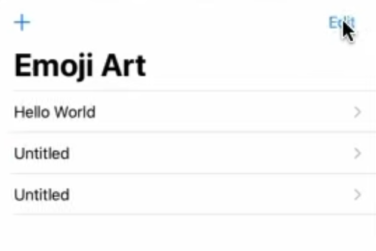
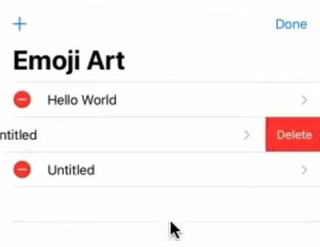
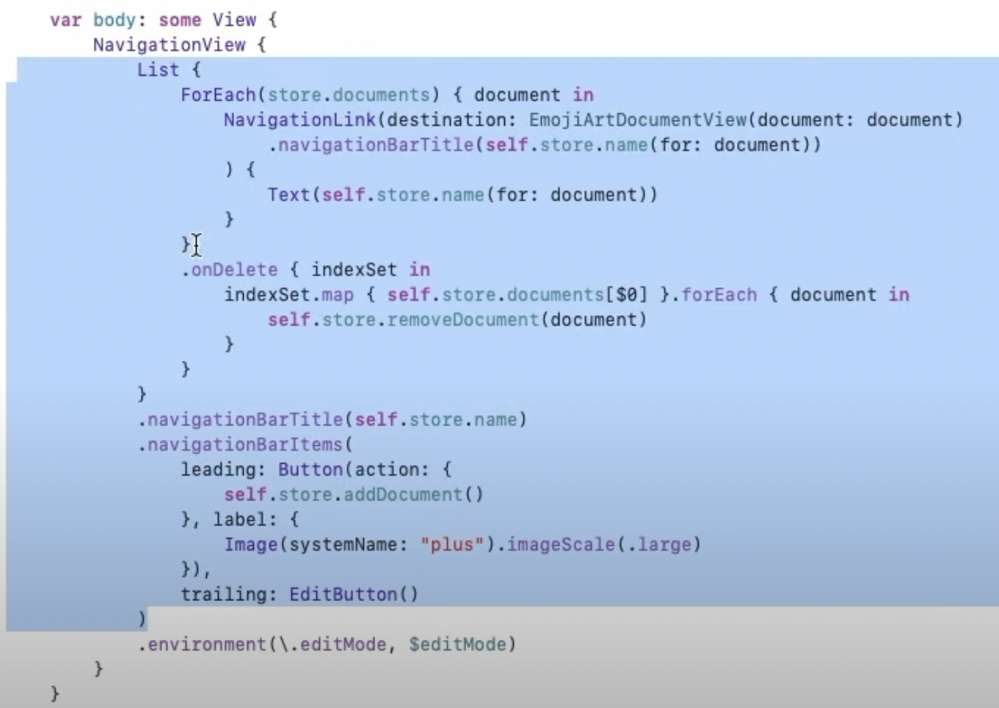
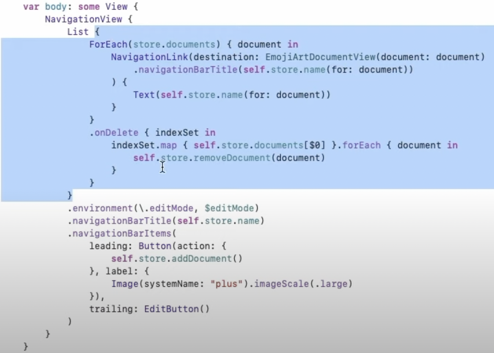
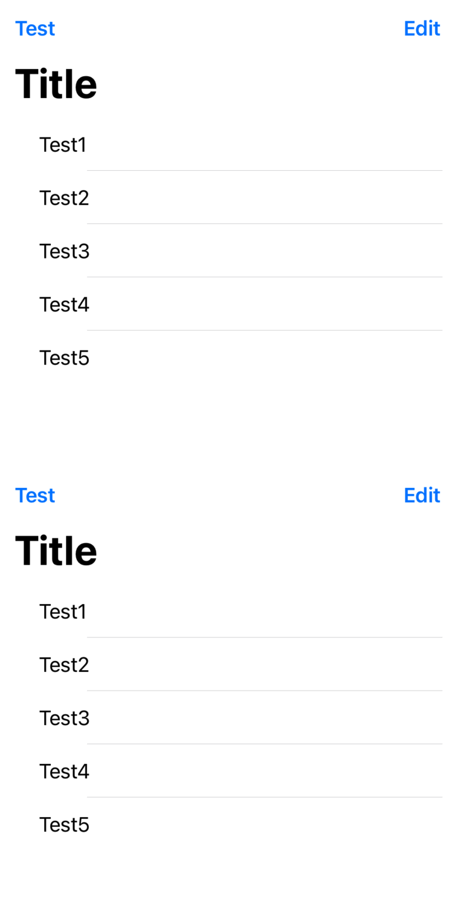

## Reference
[Lecture 10: Navigation + TextField](https://youtu.be/CKexGQuIO7E)

### Initialize State

```swift
// https://youtu.be/CKexGQuIO7E?t=108
@State private var chosenPalette: String = ""

init(document: EmojiArtDocument) {
	_chosenPalette = State(wrappedValue: self.document.defaultPalette)
}
```

### Popover

```swift
// https://youtu.be/CKexGQuIO7E?t=338
// Two of them involved passing it a Binding to an Identifiable
// and that Identifiable is gonna kind of identify what thing you wanna show in the popover.
// To set this to true whenever I want the popover to appear.
// If the user taps somewhere else outside the popover, it's gonna set this back to false, and then it'll disappear.
@State private var showPaletteEditor = false

var body: some View {
	Image(systemName: "keyboard")
		.onTapGesture {
			self.showPaletteEditor = true
		}
		// The default zIndex is zero.
		// https://youtu.be/CKexGQuIO7E?t=4791
		.zIndex(-1)
		.popover(isPresented: $showPaletteEditor) {
			// ViewBuilder: Content
			// It's sizing itself to fit our content.
			PaletteEditor()
				.frame(minWidth: 300, minHeight: 500)
		}
		// https://youtu.be/CKexGQuIO7E?t=6070
		.alert(isPresented: $self.explainBackgroundPaste) {
			return Alert(
				title: Text(""),
				message: Text(""),
				// It also takes a closure that'll be executed when this Button is pressed.
				// And this dismiss Button, will set this back to false.
				// .default(Text("OK"), {})
				dismissButton: .default(Text("OK"))
			)
		}
		.alert(isPresented: $self.confirmBackgroundPaste) {
			return Alert(
				title: Text(""),
				message: Text(""),
				primaryButton: .default(Text(""), {}),
				secondaryButton: .cancel()
			)
		} 
}
```

### TextField Input (Form, Section, onEditingChanged)

```swift
struct EmojiArtDocument: View {
	let document: EmojiArtDocument

	@Binding var chosenPalette: String

	var body: some View {
		Image()
			.popover(isPresented: $showPaletteEditor) {
				PaletteEditor()
					.frame(minWidth: 300, minHeight: 500)
					.environmentObject(self.document)
			}
	}
}

struct PaletteEditor: View {
	@EnvironmentObject var document: EmojiArtDocument
	@State private var paletteName: String = ""

	var body: some View {
		Form {
			Section {
				// This argument is whether the editing changed
				// because editing started, began in the TextField or because it ended.
				TextField("PaletteName", text: $paletteName, onEditingChanged: { began in
					if !began {
						self.document.renamePalette(self.chosenPalette, paletteName)
					}
				})
			}
		}
		.onAppear {
			// We need to initialize it to be the name of the showing palette.
			self.paletteName = self.document.paletteName[self.chosenPalette]
		}
	}
}
```

### Grid(KeyPath)

```swift
Grid(chosenPalette, id: \.id) { emoji in
	Text(emoji).onTapGesture { /* remove */ }
}

// Grid requires that everything that's passed to it be Identifiable.
// KeyPath specifies a certain var to access on an instance of an object.
// KeyPath<Item, ID> ID must be Hashable.
struct Gride<Item, ID, ItemView>: View where ID: Hashable ItemView: View {
	private var items: [Item]
	private var id: KeyPath<Item, ID>
	private var viewForItem: (Item) -> ItemView

	// One is the kind of object that you are looking for a var on.
	// The second is the return value of it.
	init(_ items: [Item], id: KeyPath<Item, ID>, viewForItem: @escaping (Item) -> ItemView) {
		self.items = items
		self.id = id
		self.viewForItem = viewForItem
	}

	var body: some View {
		// ForEach looks at all it's items and for each of one, it builds the View for it.
		// It probably has to keep these items in some sort of Dictionary or hash table or something
		// so that it can know which View is associated with them.
		// ForEach requires that ID, this ID conform to Hashable.
		ForEach(items, id: \.id) { item in
			self.body(for: item, in: layout)
		}
	}

	func body(for item: Item, in layout: GridLayout) -> some View {
		let index = items.firstIndex(where { item[keyPath: id] == $0[keyPath: id] })
		return Group {}
	}
}
```

```swift
// Hashable: https://youtu.be/CKexGQuIO7E?t=3260
class EmojiArtDocument: ObservableObject, Hashable {
	let id = UUID()

	// This hasher is just an object that's given to you when you're being asked to hash.
	// This hasher has combine, and you give it something here, that is itself Hashable,
	// it combines possibly multiple things inside your object to make it Hashable.
	// We're combining Hashable things to make something Hashable.
	// To be hashable, you have to implement Equatable.
	func hash(into hasher: inout Hasher) {
		hasher.combine(id)
	}
}
```

### Navigation and List

```swift
// https://youtu.be/CKexGQuIO7E?t=3800
struct Chooser: View {
	var body: some View {
		NaviagationView {
			// ForEach doesn't do layouts.
			// So we have to put this in an HStack or VStack.
			// List, kind of like a VStack, creates a big scrollable list with separators and all that stuff.
			// It looks just like in what in the old UIKit we called a TableView.
			// To remove underline >> UITableView.appearance().backgroundColor = .clear
			List {
				ForEach(store.documents) { document in
					// https://youtu.be/CKexGQuIO7E?t=4035
					// NavigationLink has quite a few ways to create it.
					// The destination is where the link is gonna go when you tap on it.
					// In other words, give me a View to navigate to when I click on this.
					NavigationLink(destination: EmojiArtDocument()
						.navigationBarTitle(document.name)
					) {
						Text()
					}
				}
				// https://youtu.be/CKexGQuIO7E?t=5293
				.onDelete { indexSet in
					// An indexSet is kind of like an Array of indices,
					// and it's telling you the things that were deleted.
					indexSet.forEach { index in self.store.delete(index) }
				}
			}
			.navigationBarTitle(self.store.name)
			.navigationBarItems(leading: Button(action: {
				self.store.addDocument()
			}, label {
				Image(systemName: "")
			})
		}
	}
}
```

### EditMode

| EditMode Off                               | EditMode On                              |
| ------------------------------------------ | ---------------------------------------- |
|  |  |

```swift
// `.environment` 를 이용해서 set 할 수 있다.
// Binding 을 받기 때문에 State 를 선언해서 $ 연결

struct Chooser: View {
	// You can get the editMode
	@Environment(\.editMode) var editMode: EditMode

	// for set value
	@State private var editMode: EditMode = .inactive

	var body: some View {
		NaviagationView {
			List {
				ForEach(store.documents) {
					NavigationLink(destination: EmojiArtDocument()
						.navigationBarTitle(document.name)
					) {
						Text()
					}
				}
				.onDelete { indexSet in
					indexSet.forEach { index in self.store.delete(index) }
				}
			}
			// EditButton is a SwiftUI struct.
			// When you click EditButton,
			// if you have a List and there's a onDelete on your ForEach, 
			// it will put you in this mode where you can delete by clikcing delete button.
			.navigationBarItems(leading: EditButton())
			// `.environment` takes the path editMode, and it takes what you wanna set it to.
			// `.environment` sets that var in EnvironmentValues only for the View you call it on.
			.environment(\.editMode, $editMode)
		}
	}
}
```

| Correct Environmnet                             | Wrong Environment                               | Environment example                                      |
| ----------------------------------------------- | ----------------------------------------------- | -------------------------------------------------------- |
|  |  |  |

```swift
struct ContentView: App {
    // @State private var editMode: EditMode = .inactive

    var body: some Scene {
        VStack {
            Chooser(editMode: $editMode)
            Chooser(editMode: $editMode)
        }
    }
}

struct Chooser: View {
    let documents: [String] = ["Test1", "Test2", "Test3", "Test4", "Test5"]

    var body: some View {
        NavigationView {
            List {
                ForEach(documents) { document in
                    Text(document)
                }
                .onDelete(perform: { indexSet in
                    print(indexSet)
                })
            }
            .navigationTitle("Title")
            .navigationBarItems(
                leading: Button("Test", action: { }),
                trailing: EditButton()
            )
        }
    }
}
```

### Copy and Paste

```swift
// https://youtu.be/CKexGQuIO7E?t=4340
// Copy and paste
struct EmojiArtDocumentView: View {
	var body: some View {
		.navigationBarItems(trailing: Button(action: {
			// UIPasteboard.general is a shared Pasteboard that represents the Pasteboard on this device.
			// It has a lot of different vars like string, url, other kinds of types.	
			if let url = UIPasteboard.general.url {
				self.document.backgroundURL = url
			}
		}, label: {
			Image(systemName: "")
		})
	}
}
```