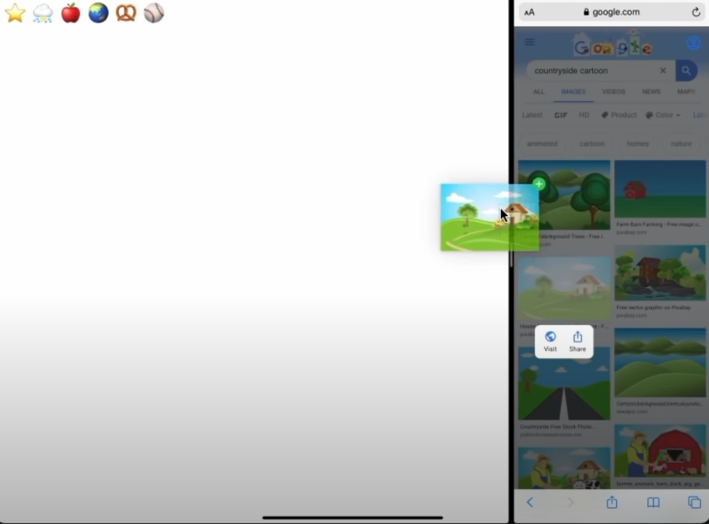
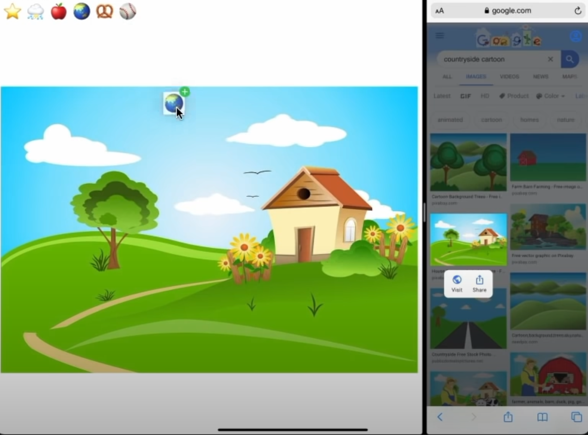
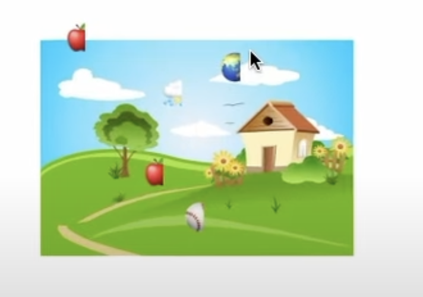
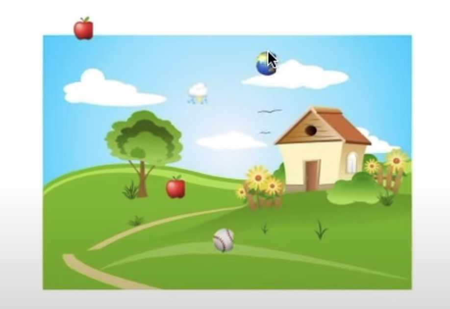

## Reference
[Lecture 7](https://youtu.be/tmx-OwkBWxA)
[Lecture 8](https://youtu.be/mz-rNLWJ0bk)

## Colors and Images

```swift
// can be a Color specifier
.foregroundColor(Color.green)
// can also be a ShapeStyle 
.fill(Color.blue)
// could even be a View.
Color.white
```
UIColor comes from the old pre-SwiftUI world. Things that start with UI are from UIKIt. It was good at manipulating colors.

[Image in SwiftUI is primarily a View and it's a View that displays an image. It's not something that you would make a var of type Image and it holds an image. 
It will use `Image(_ name: String)` as the name of an image that it finds in your Assets.xcassets file. UIImage, that's the thing that if you had a var that was gonna hold an image in it, like a JPEG image, it would be of type UIImage. It was so good at handling images.](https://youtu.be/tmx-OwkBWxA?t=190)

## Multithread Programming

### [Threads](https://youtu.be/tmx-OwkBWxA?t=454)

It just appears that you've got different pieces of code executing simultaneously. They're running at the exact same time somehow.

### [Queues](https://youtu.be/tmx-OwkBWxA?t=498)

A queue is nothing more that a bunch of blocks of code that are sitting in line just patiently waiting to get a thread of execution that will go and run them. 

[Anytime you want to do something in the UI, you have to use the main queue. There is some stuff like animation where all the calculations of the animation, the inter-frame, the animatableData that is going to happen in another queue off the main queue. But it's all gonna get coordinated back onto the main queue to do the drawing.  So the stuff all happens without smashing into each other.](https://youtu.be/tmx-OwkBWxA?t=592) 

[To do the non-UI stuff is in the pile of background queues. The system manages a bunch of threads to go pull blocks of code off of these background queues. They're running simultaneously with what's on the main queue. The main queue always gets higher priority.](https://youtu.be/tmx-OwkBWxA?t=653) 

[GCD's dispatching the code from the queues to be executed by the threads. One is getting a queue and two, plopping a block of code on the queue.](https://youtu.be/tmx-OwkBWxA?t=714) 

[`queue.sync` blocks and wait. It waits until it has taken this block of code off of its queue and executed it to completion. So we would never call queue.sync in UI code because it would block the UI.](https://youtu.be/tmx-OwkBWxA?t=881) 

```swift
// https://youtu.be/tmx-OwkBWxA?t=1055
DispatchQueue(global. userInitiated).async {
  // do something that might take a long time
  DispatchQueue.main.async {
    // UI code
  }
}
```

## Drag and Drop
<br>

| Drag Image from Browser                | Drag Text from Palette               |
| -------------------------------------- | ------------------------------------ |
|  |  |

```swift
struct EmojiArtDocumentView: View {
  var body: some View {
    VStack {
      ScrollView(.horizontal) {
        // https://youtu.be/tmx-OwkBWxA?t=4971
        HStack {
          ForEach(EmojiArtDocument.palette.map { String($0) }, id: \.self) {
            Text(emoji)
            // This function just needs to return the things to drag.
            .onDrag { NSItemProvider(object: emoji as NSString) }
          }
        }
      }
      GeometryReader { geometry in
      Rectangle().foreground(.white) // can replace it with `Color.white`
        // [Why didn't I just make a ZStack here?](https://youtu.be/tmx-OwkBWxA?t=3681)
        // This has to do with sizing.
        // We want DocumentView to be sized like it was a Rectangle.
        // Basically we wanted to use all the space offered to it. (Shape take all the space offered to them.)
        // We wouldn't want it to size it to the Image, because they size themselves to the size of the image.
        // (If you have a small image, we would have small little View here.)
        .overlay(Image(self.document.backgroundImage!))
        .edgesIgnoringSafeArea([.horizontal, .bottom])
        // https://youtu.be/tmx-OwkBWxA?t=3290
        // The first argument is what kind of things do you want to drop. `public.image` is what's called a URI.
        // It specifies kind of a public agreement of the type of things that are images.
        // But If you drag and drop an image, very likely the providewr of that image can also provide you its URL.
        // `isTargeted` argument is what's called a Binding.
        .onDrop(of: ["public.image", "public.text"], isTargeted: nil) { providers, location in
          // The first argument `providers` are objects called NSItemProviders that provide the information that's being dropped.
          // The second argument `location` is the location of the drop.
          // It's currently in global coordinate systems, the coordinate system of the entire device.
          var location = geometry.convert(location, from: .global)
          location = CGPoint(x: locationx - geometry.sizw.width/2, y: location.y - geometry.size.height/2)
          // This function is supposed to return whether the drop succeeded. 
          return self.drop(providers: providers, at: location)
        }
      }
    }
    }
  
  private func drop(providers: [NSItemProdiver]) -> Bool {
    // It calls a function where it passes you the URL that it was able to find. 
    var found = providers.loadFirstObject(ofType: URL.self) { url in
      self.document.setBackground(url: url)
    }
    if !found {
      found = providers.loadObjects(ofType: String.self) { string in
        self.document.addEmoji(string, at: location, size: self.defaultEmojiSize)
      }
    }
    return found
  }
}
```

```swift
// [Trick - Using ViewBuilder](https://youtu.be/tmx-OwkBWxA?t=3915)
Color.white.overlay(
  Group {
    if self.document.backgroundImage != nil {
      Image(uiImage: self.document.backgroundImage!)
    }
  }
)
```

## UserDefaults

UserDefaults can only store what is called a PropertyList.
PropertyList is a just concept, any combination of Strings, Ints, Bools, Float or Double, Dates, Data, Arrays and Dictionaries.
UserDefaults, when you put things in UserDefaults, it doesn't run right out to the disk and write it out, it buffers them up and writes them out at an appropriate time, when it's convenient.
When you switch to another app, UserDefaults is always gonna write the database out.
When you have a change and you want UserDefaults to write things out, just switch to another app.

```swift
// Object has to be a PropertyList.
UserDefaults.standard.set(object, forKey: "somekey")
UserDefaults.standard.setDoulbe(7.5 forKey: "somekey2")

// Codable can help you turn almost any struct, even an Array of some wacky thing, into a Data.
UserDefaults.standard.integer(forKey: "integerKey")
UserDefaults.standard.url(forKey: "urlKey")

```

## [Gestures](https://youtu.be/mz-rNLWJ0bk?t=520)

### Discrete Gesture

There is just a ViewModifier on View called `.gesture`, and you just pass a Gesture. 
You do something by calling the function on your gesture `.onEnded`, which takes a closure, and in that closure you do whatever you want when that TapGesture ends.

```swift
// When a discrete gesture is recognized, we use `.onEnded { }`.
var theGesture: some Gesture {
	return TapGesture(count: 2)
		.onEnded { /* do something. */ }
}
// convenience version
myView.onTapGesture { }
myView.onLongPressGesture { }
```

### Non Discrete Gesture

In a non-discrete gesture, you do get to handle when it ends, you can also handle as it's moving, as the finger are pinching together or as the finger is dragging itself around the screen.

```swift
// The only difference is the closure gets an argument.
// That is going to tell you what happened.
// ex) the location of the fingers, the scale of the magnification, the angle of the rotation.
var theGesture: some Gesture {
	DragGesture()
		.onEnded { value in /* do something. */ }
}
```

```swift
// That is only going to be in effect while the Gesture is going on.
// All the things you need to know to draw yourself in the middle of this Gesture.
@GestureState var myGestureState: MyGestureStateType

var theGesture: some Gesture {
	DragGesture()
		// The first one in parenthesis there is your GestureState var.
		// `.updating` takes a closure. It's gonna call that thing repeatedly
		// as the finger are moving closer together or the fingers dragging across the screen.
		.updating($myGestureState) { value, myGestureState, transaction in
			// https://youtu.be/mz-rNLWJ0bk?t=1120
			// This is the only way you're supposed to change your @GestureState.
			// There's actually no reason to set it any other time then while this thing's going on.
			myGestureState = value
		}
		// Simpler version of `.updating`.
		.onChanged { value in /* do something */ }
		.onEnded { value in /* do something */ }
}
```

## Demo

### [Failable Initializer](https://youtu.be/mz-rNLWJ0bk?t=2156)

```swift
// If you put question mark right after init
init?(json: Data?) {
	if json != nil, let newEmojiArt = try? JSONDecoder().decode(EmojiArt.self) {
		self = newEmojiArt
	} else {
		// If this initializer returns nil,
		//then they'll get nil back as the object they were trying to create.
		return nil
	}
}
```

### [Clipped](https://youtu.be/mz-rNLWJ0bk?t=2500)

```swift
ZStack {
	Color.white.overlay(
		Group {
			if self.document.backgroundImage != nil {
				Image(uiImage: self.document.backgroundImage!)
			}
		}
	)
}
// The default in SwiftUI is for Views to be able to draw outside of their boundaries
// So If we wanna keep a View inside its boundaries, we have to do a modifier on it.
.clipped()
```

### [ZoomScale](https://youtu.be/mz-rNLWJ0bk?t=2793)

```swift
struct EmojiArtDocumentView: View {

	var body: some View {
		GeometryReader { geometry in
			ZStack {
				Color.white.overlay(OptionalImage())
					.gesture(self.doubleTapToZoom(in: geometry.size))
				ForEach { emoji in
					Text(emoji)
						.position(self.position(for: emoji, in: geometry.size))
				}
			}
			.clipped()
			.onDrop(of: ["public.image", "public.text"], isTargeted: nil) { providers, location in
				var location = geometry.convert(location, from: .global)
				location = CGPoint(x: location.x - geometry.size.width / 2, y: location.y - geometry.size.height / 2)
				location = CGPoint(x: location.x / self.zoomScale, y: location.y / self.zoomScale)
				return self.drop(providers: providers, at: location)
			}
		}
	}

	private func position(for emoji: EmojiArt.Emoji, in size: CGSize) -> CGPoint {
		var location = emoji.location
		location = CGPoint(x: location.x * zoomScale, y: location.y: zoomScale)
		location = CGPoint(x: location.x + size.width / 2, y: location.y + size.height / 2)
		return location
	}

	private func doubleTapToZoom(in size: CGSize) -> some Gesture {
		TapGesture(count: 2)
			.onEnded {
				// 
				withAnimation {
					self.zoomToFit(self.document.backgroundImage, in: size
				}
			}
	}

	private func zoomToFit(_ image: UIImage?, in size: CGSize) {
		if let image = image, image.size.width > 0, image.size.height > 0{
			let hZoom = size.width / image.size.width
			let vZoom = size.height / image.size.height
			self.zoomScale = min(hZoom, vZoom)
		}
	}
}
```

### [AnimatableFont](https://youtu.be/mz-rNLWJ0bk?t=3310)

| Font Problem                                       | AnimatableData                                     |
| -------------------------------------------------- | -------------------------------------------------- |
|  |  |

```swift
// size changed, but font not changed
struct AnimatableSystemFontModifier: AnimatableModifier {
	func body(content: Content) -> some View {
		content.font(Font.system(size: size, weight: weight, design: design))
	}

	var animatableData: CGFloat {
		get { size }
		set { size = newValue }
	}
}
```
